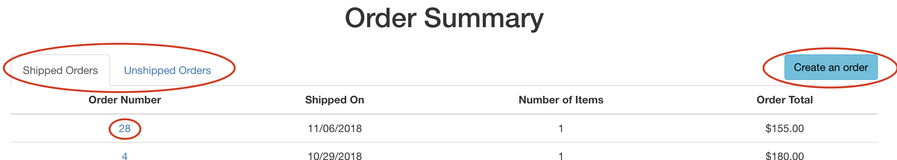
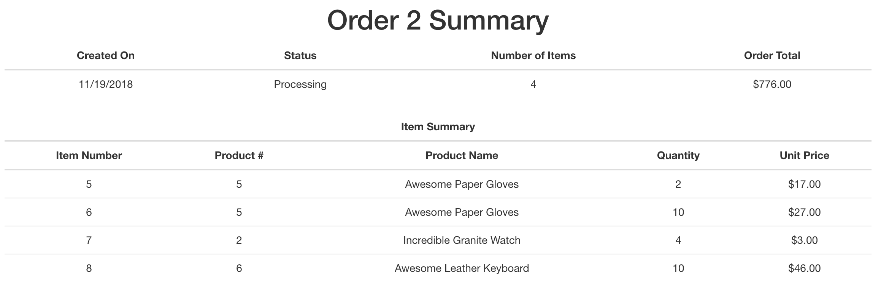
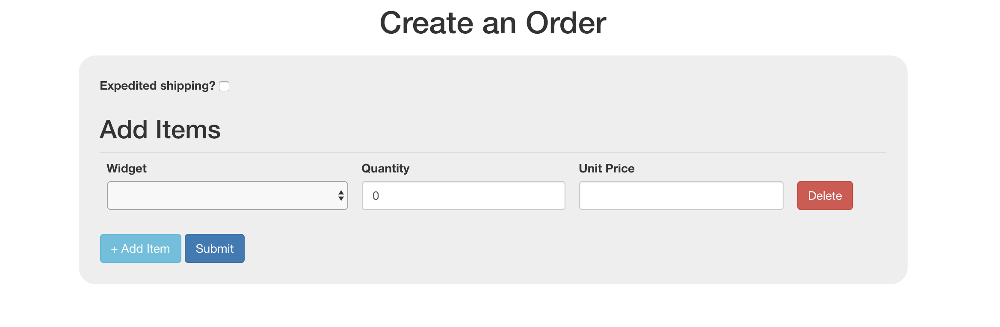
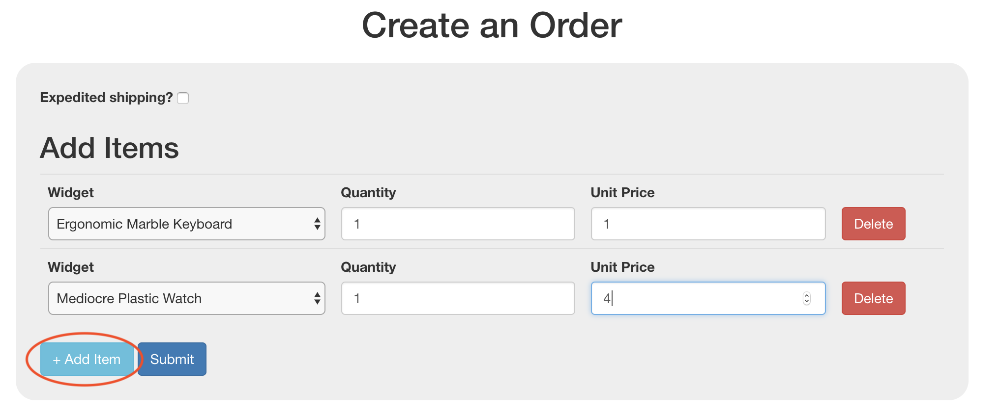
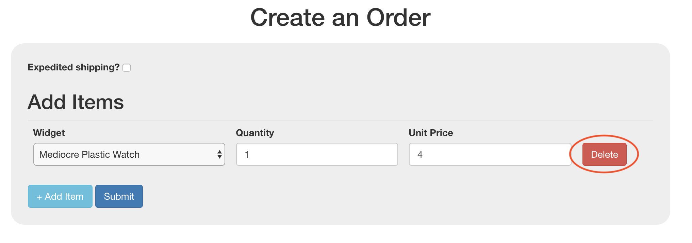

# README

## Welcome to the Widget Shop!
In the market for some widgets? Well, you've come to the right place! We have 10s of widgets for sale. Once you're set up by following the instructions below, you can get started creating and managing orders!

## Setup
First, clone this repo:
```bash
git clone https://github.com/tori-wood/rails-code-challenge.git
```
Install dependencies, set up the database, and make sure everything is running as expected by running the tests:
```bash
bundle install
bundle exec rails db:create db:migrate db:seed
bundle exec rspec
```
Now that our setup is taken care of, let's boot up the rails server and start ordering some widgets!
```bash
rails server
```

## Shop Overview
#### Orders Summary Page
This [page](http://localhost:3000/) lists all orders grouped by shipment status (either shipped or unshipped). Shipped orders are sorted by most recent shipping date by default. You can toggle back and forth between shipped and unshipped orders by clicking the tabs at the top of the table.

Each order number has a link that will take to that order's summary page. There is also a button in the top right hand corner that will take you to the form to create new orders.



#### Individual Order Summary Page
This page shows relevant information on an order such as the shipping date if it's already shipped, the total number of items in the shipment, the order total, and a breakdown of all items contained in the shipment.



#### Create an Order Page
On this page, you'll be able to create and submit new orders. Check the "expedited shipping" option if the order needs to be out as soon as possible. Below that, you can choose the type of widget along with fields to set the quantity and price. You can dynamically add and remove items to the order as you go.

To add an item, click the blue button on the bottom left of the form.


A new item will appear on the screen.


To remove an item, click on the delete button next to that item on the right side of its row.


Click the Submit button to enter the order. Assuming all of the inputs are valid, you'll be taken to the new order's summary page.
